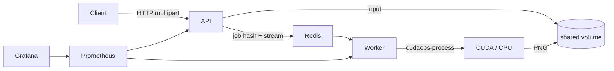

# CUDAOps Platform


CUDAOps is a small, public DevOps reference platform for queued GPU work. It accepts one PNG or JPEG, runs deterministic Sobel edge detection on CUDA (or a CPU fallback), returns a PNG, and exposes Prometheus metrics and a provisioned Grafana dashboard.



## Prerequisites

- Docker Desktop with the WSL2 backend and Compose v2
- NVIDIA driver with WSL GPU support (CUDA execution only)
- NVIDIA Container Toolkit support through Docker Desktop

See [the Windows/WSL setup guide](docs/setup-wsl.md) for the pinned development environment. Do not install a Linux display driver inside WSL.

## Quick start

```bash
cp .env.example .env
docker compose up --build
```

The API listens at `http://localhost:8080`, Prometheus at `http://localhost:9090`, and Grafana at `http://localhost:3000` (`admin` / `cudaops`). To verify CPU fallback without GPU access:

```bash
docker compose -f compose.yaml -f compose.cpu.yaml up --build
```

## API example

```bash
job=$(curl -fsS -F image=@photo.jpg -F device=auto http://localhost:8080/v1/jobs)
id=$(printf '%s' "$job" | jq -r .id)
curl -fsS "http://localhost:8080/v1/jobs/$id"
curl -fS "http://localhost:8080/v1/jobs/$id/result" -o edges.png
```

The status response reports `requested_device`, `used_device`, and `fallback_used` so the selected processor is observable.

## Tests and benchmarks

```bash
make test
make vet
IMAGE=/path/to/image.png make benchmark
docker compose config --quiet
```

GPU parity checks require an RTX 5060 (compute capability `sm_120`) and CUDA 13.1. The benchmark warms each implementation and reports repeated-run median and p95 latency; no benchmark values are checked into the repository.

## Kubernetes

The Phase 2 Helm chart deploys the API, GPU worker, Redis, and shared job storage to a GPU-enabled Kubernetes cluster. See [the Kubernetes deployment guide](docs/deploy-kubernetes.md) for required RWX storage, image registry configuration, GPU scheduling, and the CPU-only override.

## v0.1 limitations

One worker processes one image at a time. There is no authentication, cancellation, retention policy, web UI, distributed tracing, or remote GPU CI. Terraform, Prometheus Operator resources, cluster-managed GPU telemetry, production Redis, and additional image operations remain deferred.

This independent project is not affiliated with or endorsed by NVIDIA.
