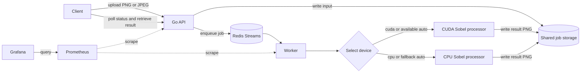

<div align="center">

# CUDAOps

**A personal CUDA learning lab, wrapped in queues, observability, containers, and Kubernetes.**

<p>
  <a href="https://github.com/dericsanandres/cudaops-platform/actions/workflows/ci.yml"></a>
  <a href="https://github.com/dericsanandres/cudaops-platform/actions/workflows/security.yml"></a>
  <a href="https://github.com/dericsanandres/cudaops-platform/releases/latest"></a>
</p>

<p>
  
  
  
</p>

</div>

CUDAOps began as my hands-on way to learn CUDA on a laptop GPU. I wanted to understand more than a standalone kernel, so I put a small deterministic image processor behind an API and then followed the job through Redis, a worker, shared storage, metrics, containers, and Kubernetes. It is an engineering experiment, not a production product or a performance showcase.

## Why I built this

Running a CUDA kernel answered only the first question: could I make useful work happen on the GPU? The more interesting learning came from the boundaries around it—choosing CPU or CUDA, keeping outputs identical, recovering interrupted jobs, observing fallbacks and retries, packaging the runtime, and deploying the same flow elsewhere.

Sobel edge detection keeps the compute step easy to inspect. The rest of the repository lets me explore how GPU work behaves as part of a service.

## What the project does

- Accepts one PNG or JPEG through an HTTP API.
- Queues the job in Redis Streams and stores files on a shared volume.
- Runs deterministic Sobel edge detection on CUDA, on CPU, or with automatic CPU fallback.
- Returns a PNG and reports the requested device, device used, fallback state, and timing.
- Exposes Prometheus metrics and a provisioned Grafana dashboard.
- Packages the API and worker as containers and deploys them with a Helm chart.

## How a job moves through the system



The API and worker exchange job metadata through Redis rather than image bytes. Both mount the same storage, so an accepted upload and its final PNG remain available to the API throughout the job lifecycle.

## Hardware and development environment

The validated machine is an **ASUS TUF Gaming A16 FA608UM** with an **NVIDIA GeForce RTX 5060 Laptop GPU**, **8 GB VRAM**, and compute capability **12.0**. The CUDA processor targets **`sm_120`** and was accepted with **CUDA Toolkit 13.1** under Ubuntu 24.04 on WSL2.

The [Windows and WSL setup guide](docs/setup-wsl.md) records the pinned toolchain and preserves the important driver boundary: the Windows NVIDIA display driver is projected into WSL, so a Linux display driver should not be installed there.

## Proof it works

The [verification evidence](docs/verification.md) separates checks anyone can reproduce from results recorded on the local GPU and CPU-only Kubernetes environments. In short:

- GitHub Actions passes Go race tests and vet, CPU processor tests, invalid-input and fallback checks, Compose/container checks, Helm validation, and CodeQL analysis.
- Local acceptance covers PNG and JPEG jobs, byte-identical CPU/CUDA output, worker interruption recovery, retry limits, validation errors, Prometheus, and Grafana.
- The v0.2.0 API and worker images were published to GHCR, pulled publicly, and exercised in a CPU-only kind cluster.

GPU scheduling in Kubernetes and Prometheus Operator alert routing have not been tested.

## Honest benchmark results

This is one recorded 4096×4096 image workload, with one warm-up followed by 20 measured runs per device:

| Device | Median | p95 |
|---|---:|---:|
| CPU | 6715.079 ms | 7613.211 ms |
| CUDA | 5328.524 ms | 8123.004 ms |

CUDA achieved a **1.26× median speedup**, while its measured p95 was slower than CPU. That is useful experimental evidence about this implementation and laptop, not a general CUDA optimization claim. The benchmark records the whole processor execution path, including image decode, Sobel processing, and PNG encode—not kernel time alone.

## Quick start and API example

Docker Desktop with the WSL2 backend and Compose v2 are required. CUDA execution also needs WSL GPU support and NVIDIA Container Toolkit integration through Docker Desktop.

```bash
cp .env.example .env
docker compose up --build
```

The API listens at `http://localhost:8080`, Prometheus at `http://localhost:9090`, and Grafana at `http://localhost:3000` (`admin` / `cudaops`). Submit a job and retrieve its result:

```bash
job=$(curl -fsS -F image=@photo.jpg -F device=auto http://localhost:8080/v1/jobs)
id=$(printf '%s' "$job" | jq -r .id)
curl -fsS "http://localhost:8080/v1/jobs/$id"
curl -fS "http://localhost:8080/v1/jobs/$id/result" -o edges.png
```

The status response includes `requested_device`, `used_device`, and `fallback_used`. To run without GPU access:

```bash
docker compose -f compose.yaml -f compose.cpu.yaml up --build
```

## Kubernetes and published images

The Phase II Helm chart deploys the API, worker, Redis, and shared job storage. The [Kubernetes guide](docs/deploy-kubernetes.md) covers RWX storage, GPU scheduling, immutable image configuration, CPU-only deployment, and the optional Prometheus Operator resources.

Release v0.2.0 is public at:

- `ghcr.io/dericsanandres/cudaops-platform-api:0.2.0`
- `ghcr.io/dericsanandres/cudaops-platform-worker:0.2.0`

The chart defaults to these repositories and its `appVersion`, currently `0.2.0`. Exact digests and the post-release kind acceptance record are in [verification evidence](docs/verification.md) and the [v0.2.0 release notes](docs/releases/v0.2.0.md).

## Current limitations

One worker processes one image at a time. There is no authentication, cancellation, retention policy, web UI, distributed tracing, or remote GPU CI. The bundled Redis is not a production topology. Terraform, cluster-managed GPU telemetry, GPU Kubernetes acceptance, Prometheus Operator alert routing, SLO enforcement, and additional image operations remain deferred.

CUDAOps is an independent learning project and is not affiliated with, sponsored by, or endorsed by NVIDIA or ASUS. NVIDIA, GeForce, CUDA, ASUS, and TUF names and logos are trademarks of their respective owners.
